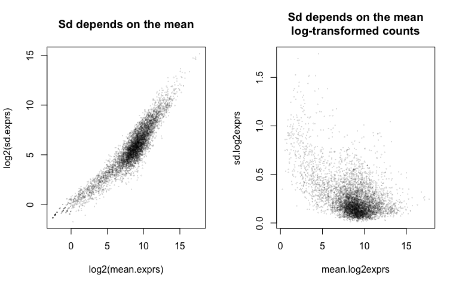
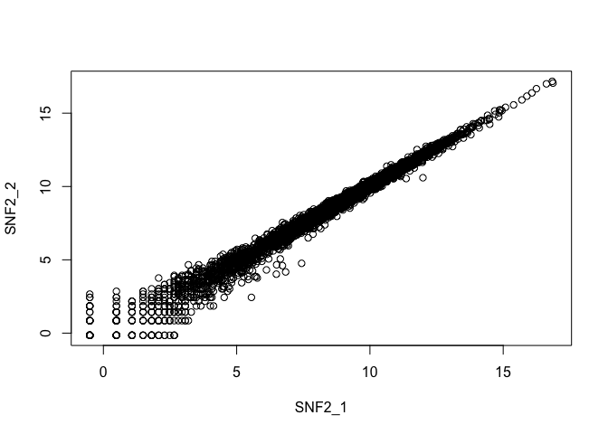
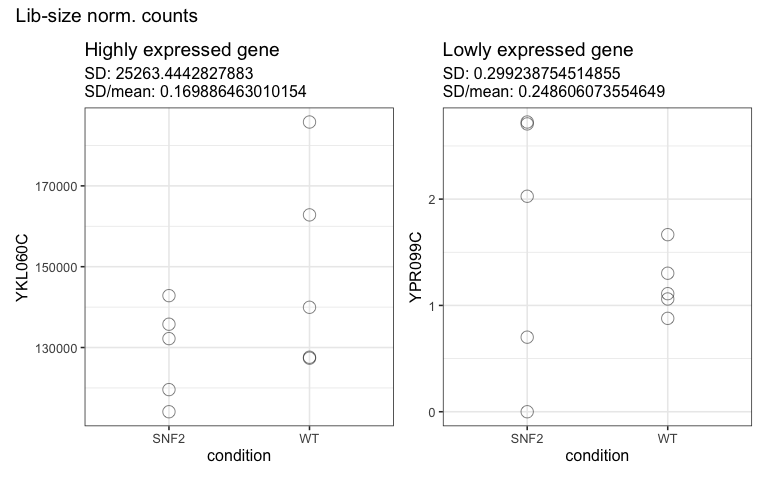
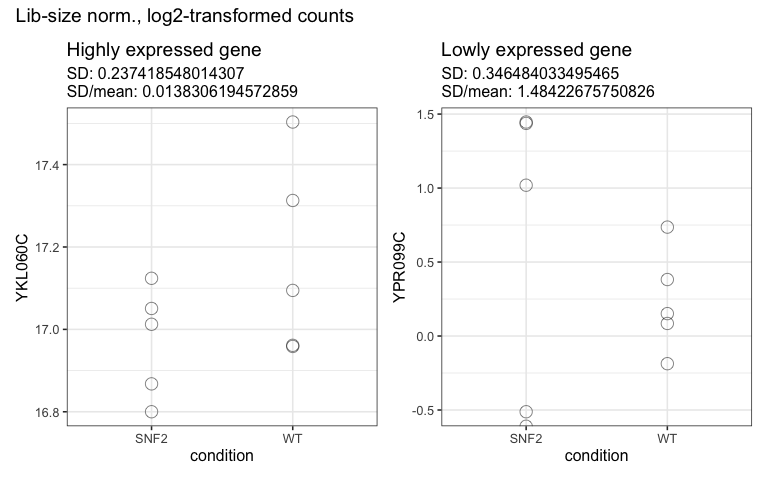
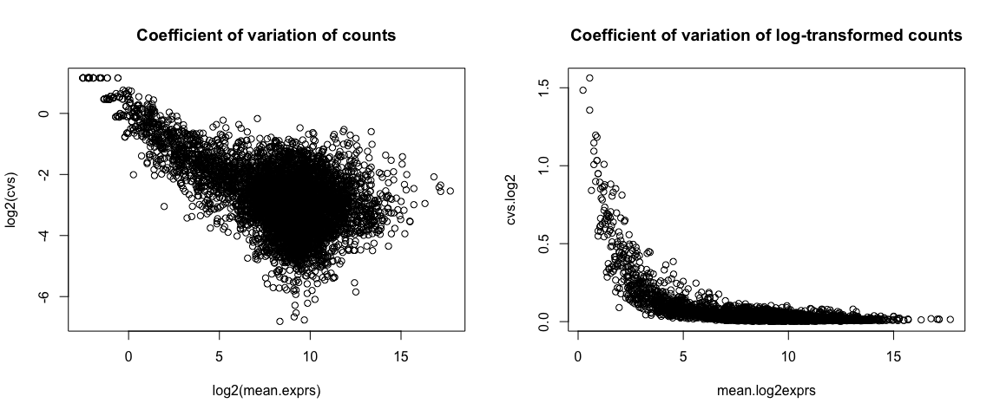

# Exploring heteroskedasticity


```r
## read counts
featCounts <- read.table("~/Documents/Teaching/ANGSD/data/featCounts_Gierlinski_genes.txt", header=TRUE, row.names = 1)
names(featCounts) <- names(featCounts) %>% gsub(".*alignment\\.", "", .) %>% gsub("_Aligned.*", "",.)
counts.mat <- as.matrix(featCounts[, -c(1:5)])

## sample info
samples <- data.frame(condition = gsub("_.*", "", colnames(counts.mat)),
  row.names = colnames(counts.mat))
samples$condition <- ifelse(samples$condition == "SNF2", "SNF2.KO", samples$condition)

## DESeq2 object
dds <- DESeqDataSetFromMatrix(counts.mat, colData = samples, design = ~condition)
# normalizing for diffs in sequencing depth and abundances per sample
dds <- estimateSizeFactors(dds) 
```

**Heteroskedasticity** = absence of homoskedasticity.
Where homoscedasticity is defined as ["the property of having equal statistical variances"](https://www.merriam-webster.com/dictionary/homoscedasticity).

Historically, **log-transformation** was proposed to counteract heteroscedasticity.
However, read counts retain unequal variabilities, even after log-transformation.
As described by [Law et al.](https://genomebiology.biomedcentral.com/articles/10.1186/gb-2014-15-2-r29):

> Large log-couts have much larger standard deviations than small counts.
> A logarithmic transformation counteracts this, but it overdoes it. Now, large counts have smaller standard deviations than small log-counts.


```r
## Greater variability across replicates for low-count genes
counts(dds, normalized = TRUE) %>% .[,1:2] %>% log2 %>% 
  plot(., main = "Greater variability of library-size-norm,\nlog-transformed counts for small count genes")
```


```r
## meanSDPlot (vsn library)
rowV = function(x, Mean) {
  sqr     = function(x)  x*x
  n       = rowSums(!is.na(x))
  n[n<1]  = NA
  return(rowSums(sqr(x-Mean))/(n-1))
}

mean.exprs   = counts(dds[, dds$condition == "WT"], normalized = TRUE) %>% rowMeans(., na.rm = TRUE)
vars.exprs   = counts(dds[, dds$condition == "WT"], normalized = TRUE) %>% 
  rowV(., Mean = mean.exprs)
sd.exprs <- sqrt(vars.exprs)
#vars <- sqrt(rowSums((x-means)^2)/(nlibs-1))


## log-transformed data
mean.log2exprs   = counts(dds[, dds$condition == "WT"], normalized = TRUE) %>% log2 %>%
  rowMeans(., na.rm = TRUE)
vars.log2exprs   = counts(dds[, dds$condition == "WT"], normalized = TRUE) %>% log2 %>%
  rowV(., Mean = mean.log2exprs)
sd.log2exprs <- sqrt(vars.log2exprs)
#vars <- sqrt(rowSums((x-means)^2)/(nlibs-1))

par(mfrow=c(1,2))
plot(log2(mean.exprs), log2(sd.exprs), main = "Sd depends on the mean", cex = .2, lwd = .1)
plot(mean.log2exprs, sd.log2exprs, main = "Sd depends on the mean\nlog-transformed counts", cex = .2, lwd = .1)
```

<!-- -->

```r
#vsn::meanSdPlot(log2(counts(dds[, dds$condition == "WT"], normalized =TRUE)))
#plot(mean.exprs, vars.exprs, main = "Var depends on the mean", xlim = c(0,1000), ylim = c(0, 2000))
#plot(mean.exprs, vars.exprs, main = "Var depends on the mean", xlim = c(0,20), ylim = c(0, 20))
```

The greater the mean expression, the greater the variance.
The greater the log-transformed expression, the smaller the variance as the average expression value and the actual expression value (`x`) are closer together.

<details>
  <summary>Click here for some toy examples to illustrate that point.</summary>


```r
1000 - 990
```

```
## [1] 10
```

```r
log2(1000) - log2(990)
```

```
## [1] 0.01449957
```

```r
10 - 9
```

```
## [1] 1
```

```r
log2(10) - log2(9)
```

```
## [1] 0.1520031
```

</details>

Intuitively, one can also see that the "spread" of the data points is greater for low-count values:


```r
counts(dds, normalized = TRUE) %>% .[,c(1,2)] %>% log2 %>% plot
```

<!-- -->


```r
# example with high expression 
mean.exprs %>% sort %>% tail # YKL060C
# example with low expression
mean.exprs[mean.exprs > 0] %>% sort %>% head #YPR099C
```

```r
high.exprsd <- "YKL060C"
low.exprsd <- "YPR099C"
```

While the absolute values of SD/Var are higher for high-count genes,
the **magnitude** of the noise is greater for the low-count genes:


```r
noise.mag <- sd.exprs[c(high.exprsd, low.exprsd)] / mean.exprs[c(high.exprsd, low.exprsd)]

p1 <- counts(dds[high.exprsd,], normalized=TRUE) %>% t %>% 
  as.data.table(., keep.rownames = "sample") %>% 
  ggplot(., aes(x = gsub("_.*", "", sample), y = YKL060C)) + 
  geom_point(size = 4, alpha = .5, shape = 1) + 
  xlab("condition") + 
  ggtitle("Highly expressed gene", subtitle = paste("SD:", sd.exprs[high.exprsd], "\nSD/mean:", noise.mag[high.exprsd]))

p2 <- counts(dds[low.exprsd,], normalized=TRUE) %>% t %>%
  as.data.table(., keep.rownames = "sample") %>%
  ggplot(., aes(x = gsub("_.*", "", sample), y = YPR099C)) +
  geom_point(size = 4, alpha = .5, shape = 1) + 
  xlab("condition") + 
  ggtitle("Lowly expressed gene", subtitle = paste("SD:", sd.exprs[low.exprsd], "\nSD/mean:", noise.mag[low.exprsd]))

p1 + p2 + plot_annotation(title = "Lib-size norm. counts")
```

<!-- -->

```r
noiselog2.mag <- sd.log2exprs[c(high.exprsd, low.exprsd)] / mean.log2exprs[c(high.exprsd, low.exprsd)]

p1 <- log2(counts(dds[high.exprsd,], normalized=TRUE)) %>% t %>% 
  as.data.table(., keep.rownames = "sample") %>% 
  ggplot(., aes(x = gsub("_.*", "", sample), y = YKL060C)) + 
  geom_point(size = 4, alpha = .5, shape = 1) + 
  xlab("condition") + 
  ggtitle("Highly expressed gene", subtitle = paste("SD:", sd.log2exprs[high.exprsd], "\nSD/mean:", noiselog2.mag[high.exprsd]))

p2 <- log2(counts(dds[low.exprsd,], normalized=TRUE)) %>% t %>%
  as.data.table(., keep.rownames = "sample") %>%
  ggplot(., aes(x = gsub("_.*", "", sample), y = YPR099C)) +
  geom_point(size = 4, alpha = .5, shape = 1) + 
  xlab("condition") + 
  ggtitle("Lowly expressed gene", subtitle = paste("SD:", sd.log2exprs[low.exprsd], "\nSD/mean:", noiselog2.mag[low.exprsd]))

p1 + p2 + plot_annotation(title = "Lib-size norm., log2-transformed counts")
```

<!-- -->

This is true irrespective of log-transformation:


```r
cvs <- sd.exprs/mean.exprs
cvs.log2 <- sd.log2exprs / mean.log2exprs

par(mfrow = c(1,2))
plot(log2(mean.exprs), log2(cvs), main = "Coefficient of variation of counts")
plot(mean.log2exprs, cvs.log2, main = "Coefficient of variation of log-transformed counts")
```

<!-- -->


The value that I named "magnitude of noise" (`noise.mag` in the code) happens to match the definition of the [**coefficient of variation**](https://en.wikipedia.org/wiki/Coefficient_of_variation)

### Fold changes are also heteroskedastic

[Love & Huber](https://genomebiology.biomedcentral.com/articles/10.1186/s13059-014-0550-8) demonstrated heteroskedasticity as "variance of log-fold changes depending on mean count".

>weakly expressed genes seem to show much stronger **differences** between the compared mouse strains than strongly expressed genes. This phenomenon, seen in most HTS datasets, is a direct consequence of dealing with count data, in which **ratios are inherently noisier when counts are low**


The fanning out on the left indicates that the logFC often tend to be higher for very lowly expressed genes.

The reasons are the same as for the underlying counts.


## Why does the heteroscedasticity matter?

Because we're using models to gauge whether the difference in read counts is greater than expected by chance
when comparing the values from group 1 (e.g. "WT") to the values from group 2 (e.g. "SNF2.KO").

**Ordinary linear models** assume that the variance is constant and does not depend on the mean.
That means, linear models will only work with **homoscedastic** data.
Knowing what we just learnt about read count data properties, we can therefore rule out that simple linear models might be applied 'as is' -- not even with log-transformed data (as shown above)! 

This is why we turned to **generalized linear models** which allow us to use models where we can **include the mean-variance relationship**.
GLM with negative binomial or Poisson regression do not make the assumption that the variance is equal for all values, instead they explicitly model the variance -- using a relationship that we have to choose.
For Poisson, that relationship is `mean = variance`.
For negative binomial models, we can choose even more complicated relationships, e.g. a quadratic relationship as it was chosen by [McCarthy et al.](https://academic.oup.com/nar/article/40/10/4288/2411520) for their `edgeR` package.

That same paper also offers a nice discussion of the properties of the noise (coefficient of variation) with the main message being:

1. Total CV = biological noise + technical noise
2. technical noise will be greater for small count genes

Here are the direct quotes from [McCarthy et al.](https://academic.oup.com/nar/article/40/10/4288/2411520) related to this:

>The coefficient of variation (CV) of RNA-seq counts should be a decreasing function of count size for small to moderate counts but for larger counts should asymptote to a value that depends on biological variability
>The first term arises from the technical variability associated with sequencing, and gradually decreases with expected count size, while biological variation remains roughly constant. For large counts, the CV is determined mainly by biological variation.

>The technical CV decreases as the size of the counts increases. BCV on the other hand does not. BCV is therefore likely to be the dominant source of uncertainty for high-count genes, so reliable estimation of BCV is crucial for realistic assessment of differential expression in RNA-Seq experiments. If the abundance of each gene varies between replicate RNA samples in such a way that the genewise standard deviations are proportional to the genewise means, a commonly occurring property of measurements on physical quantities, then it is reasonable to suppose that BCV is approximately constant across genes.

## What does "overdispersion" mean and how is it related?

Overdispersion refers to the observation that the variance tends to be *greater* than the mean expression. 
This again is an argument against the use of a simple Poisson model where the relationship between mean and variance would be fixed as `mean = variance`. 

## Summary

* Heteroskedasticity is simply the absence of equal variances across the entire spectrum of read count values.
* Depending on whether the counts are log-transformed, the variance is higher for low-count genes (log) or high-count genes (untransformed).
